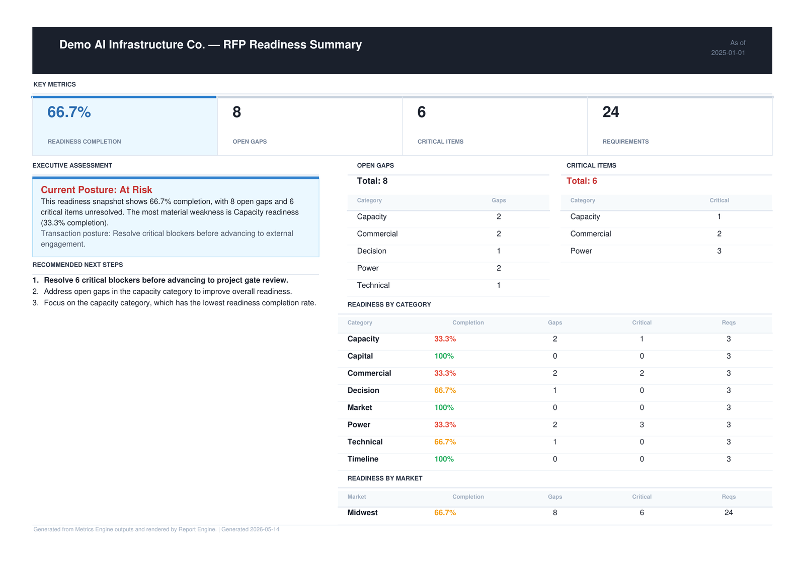
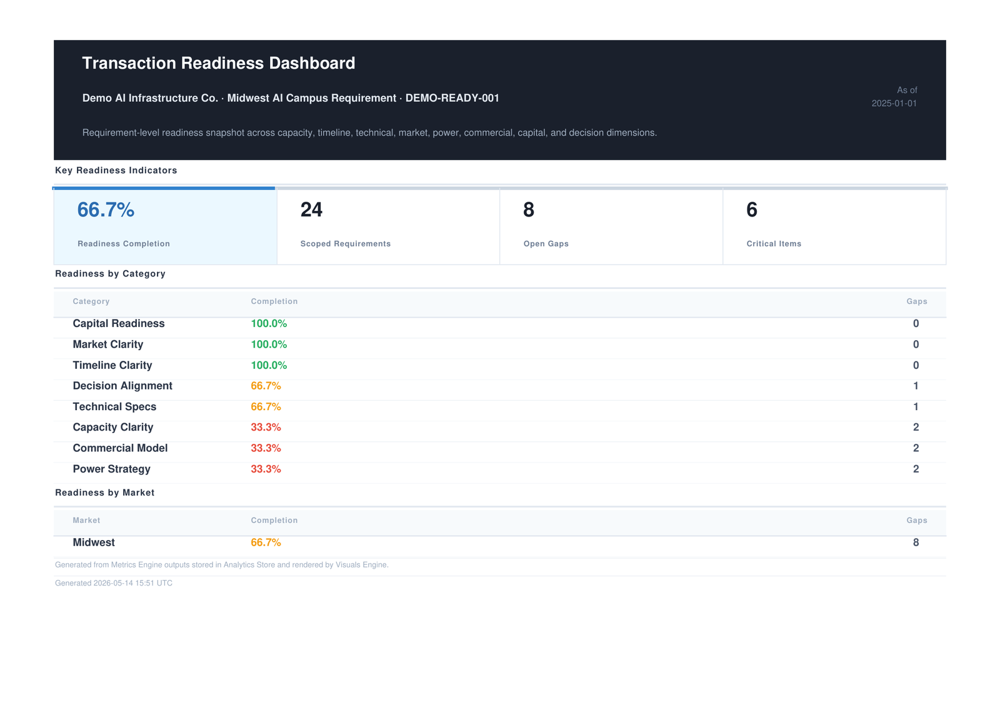
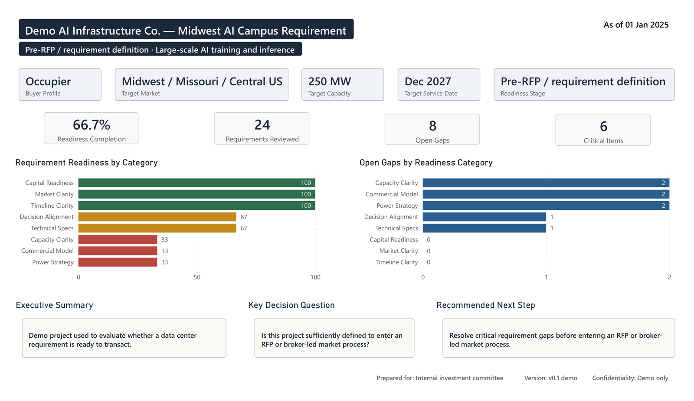

# Financial Data Analytics

[](https://github.com/Mat-Horobjowsky/financial-data-analytics/actions/workflows/ci.yml)

A modular analytics engineering portfolio. The flagship implementation is the **Data Center Transaction Readiness Toolkit** — a complete analytics system that converts a structured client intake workbook into metrics, deterministic recommendations, executive reports, dashboards, Power BI exports, an artifact manifest, and a curated client delivery package.

---

## Flagship Project: Data Center Transaction Readiness Toolkit

**Problem it solves:** Data center occupiers, developers, brokers, and investors need to determine whether a requirement or project is ready to transact. That judgment is currently made manually, inconsistently, and without a repeatable analytical foundation.

**What the toolkit does:** It takes a structured client intake workbook, resolves requirement statuses, calculates readiness KPIs, generates a deterministic executive report with category-specific recommendations, renders a self-contained dashboard, exports Power BI-ready files, and assembles a curated client delivery package — all from two CLI commands.

| Stage | Input | Output |
|---|---|---|
| Workbook Builder | Multi-sheet client intake `.xlsx` | Flat `PowerBI_Export` sheet + `client_context.csv` |
| Analytics Pipeline | Excel export sheet + client context | Report, dashboard, Power BI exports, manifest, client package |

**What the toolkit produces:**

- Executive readiness report — `report.html` + `report.pdf` (dark header, KPI cards, Executive Assessment, Recommended Next Steps)
- Transaction readiness dashboard — `readiness_dashboard.html` + `readiness_dashboard.pdf` (KPI cards, category/market breakdowns, client identity header)
- Power BI handoff — six flat CSVs ready for a reusable Power BI template
- `artifact_manifest.json` — classifies every generated file as `client_facing`, `bi_facing`, or `internal`
- `client_package/` — curated delivery folder with client-friendly file names and a generated cover `README.md`


### Sample Outputs

The canonical demo produces polished, client-facing readiness deliverables from the same validated pipeline run.

#### Executive Readiness Report



#### Transaction Readiness Dashboard




#### Power BI Companion Dashboard

The pipeline also exports a governed Power BI handoff package. The companion readiness dashboard below is built from those CSV exports and mirrors the same readiness metrics, project context, and decision posture.




**Readiness KPIs calculated:**

| Metric | Description |
|---|---|
| `readiness_completion_pct` | Percentage of requirements marked complete or closed |
| `total_requirement_count` | Total requirements in scope |
| `open_gap_count` | Requirements not yet complete |
| `critical_item_count` | Requirements marked critical |

**Why this project matters:**

This is not a dashboard layer on top of a data warehouse. It is a complete, cold-start reproducible analytics workflow that starts from a structured Excel intake file and ends with a client delivery package — built on a modular, independently testable engine stack. Clean data, trusted metrics, and visual/report rendering are strictly separated. Each layer has its own CLI, its own tests, and its own clearly scoped role. The result is a system that produces both analyst-facing and client-facing deliverables from a single repeatable workflow.

```
Clean data → Trusted metrics → Visuals anywhere
```

> **Project brief:** View the  
> [one-page summary](docs/data_center_transaction_readiness_toolkit_one_page_summary.md)  
> or download the  
> [polished PDF version](docs/data_center_transaction_readiness_toolkit_one_page_summary.pdf).


---

## Engine Stack

| Engine | Version | Input | Output |
|---|---|---|---|
| **Intake Engine** | v1.x | Raw CSV / XLSX (messy, unstructured) | Clean CSV, HTML quality report, validation JSON |
| **Metrics Engine** | v0.1 | Clean CSV | Long + wide KPI tables, metric dictionary, validation report, Excel workbook; alternate metric packs via `--config` / `--schema` |
| **Report Engine** | v1.4 | Metrics Engine output directory | Markdown + HTML reports, summary JSON, insights JSON; optional PDF via `--pdf` |
| **Analytics Store** | v0.1 | Metrics Engine output + Report Engine output (optional) | `analytics.duckdb` — 6 tables, 3 views |
| **Visuals Engine** | v0.1 | `analytics.duckdb` | Self-contained HTML dashboard, `visuals_summary.json` |
| **Analytics Pipeline** | v0.2 | Raw CSV / XLSX | All engine outputs + `pipeline_summary.json` + `artifact_manifest.json`; optional store, visuals, and Power BI export stages via `--with-store` / `--with-visuals` / `--with-powerbi-export`; named Excel sheet selection via `--sheet`; alternate metric configs via `--metrics-config` / `--schema-config`; optional `client_package/` delivery folder via `--client-package` |

Each engine is a standalone Python CLI package with tests, documented outputs, and a clearly scoped role in the pipeline.

```
Intake Engine
    ↓
Metrics Engine         (YAML-configurable — supports any metric pack)
    ↓
Report Engine
    ↓
Analytics Store        (--with-store)
    ↓
Visuals Engine         (--with-visuals)
    ↓
Power BI Export        (--with-powerbi-export)
```

---

## Setup

The full demo workflow — including PDF generation — has been validated on **Python 3.12**.

```powershell
py -3.12 -m venv .venv
.venv\Scripts\Activate.ps1      # PowerShell (Windows)
# source .venv/bin/activate     # bash (macOS / Linux)

pip install -e intake_engine `
            -e metrics_engine `
            -e "report_engine[pdf]" `
            -e analytics_store `
            -e "visuals_engine[pdf]" `
            -e readiness_workbook `
            -e analytics_pipeline
```

The `[pdf]` extras install `xhtml2pdf` so that `report.pdf` and `readiness_dashboard.pdf` are produced automatically during the demo runs below.

---

## Flagship Demo: Data Center Transaction Readiness Toolkit

This is the canonical portfolio demo. Two commands go from a committed Excel intake template to a full client delivery package.

> **Note:** The source template `examples/readiness_demo/client_intake_template.xlsx` is committed to the repo. Step 1 generates `client_intake_template_demo.xlsx` and `client_context.csv` as local-only outputs (excluded by `.gitignore`).

### Step 1 — Build the export workbook and client context

The `readiness-workbook` CLI resolves each requirement's status from the `Requirement_Map` and `Client_Export` sheets, writes a flat `PowerBI_Export` sheet into a new output workbook, and generates `client_context.csv` alongside it.

```powershell
readiness-workbook build `
  --workbook examples/readiness_demo/client_intake_template.xlsx `
  --output examples/readiness_demo/client_intake_template_demo.xlsx `
  --client-context-output examples/readiness_demo/client_context.csv `
  --demo-context
```

Writes two files (both ignored by `.gitignore` — local only):
- `client_intake_template_demo.xlsx` — copy of the workbook with `PowerBI_Export` sheet populated
- `client_context.csv` — project metadata (client name, capacity, markets, timeline, executive summary)

### Step 2 — Run the full analytics pipeline

```powershell
analytics-pipeline run `
  --input examples/readiness_demo/client_intake_template_demo.xlsx `
  --sheet PowerBI_Export `
  --output outputs/demo_readiness_client `
  --metrics-config metrics_engine/config/readiness_metrics.yaml `
  --schema-config metrics_engine/config/readiness_schema.yaml `
  --template readiness_summary `
  --pdf `
  --report-title "Demo AI Infrastructure Co." `
  --with-visuals `
  --with-powerbi-export `
  --client-context examples/readiness_demo/client_context.csv `
  --client-package
```

The `--sheet` flag passes the named Excel sheet directly to the Intake Engine. The `--template readiness_summary --pdf` flags produce a polished one-page landscape PDF and a client-facing HTML report. The `--client-context` flag injects client identity into the dashboard header, copies project metadata into the Power BI exports, and populates the `client` block in `pipeline_summary.json` and `artifact_manifest.json`. The `--client-package` flag assembles the curated delivery folder.

**Client delivery package:**

```
outputs/demo_readiness_client/client_package/
  README.md                   ← generated delivery cover with client identity and deliverable table
  package_manifest.json       ← trimmed manifest of client-facing artifacts
  executive_report.html
  executive_report.pdf
  readiness_dashboard.html
  readiness_dashboard.pdf
  powerbi/
    readiness_kpis.csv
    readiness_by_category.csv
    readiness_by_market.csv
    validation_summary.csv
    metric_dictionary.csv
    client_context.csv
```

**Full pipeline output tree:**

```
outputs/demo_readiness_client/
  intake/                            ← cleaned readiness data
  metrics/                           ← readiness KPI tables
  report/                            ← report.html, report.pdf, report.md
  store/analytics.duckdb
  visuals/readiness_dashboard.html
  visuals/readiness_dashboard.pdf
  powerbi/                           ← flat CSVs for reusable Power BI template
  pipeline_summary.json
  artifact_manifest.json             ← classifies every output as client_facing / bi_facing / internal
  client_package/                    ← curated delivery folder
```

### Dashboard output

`readiness_dashboard.html` opens offline in any browser. It renders KPI cards, category breakdowns, and market breakdowns from `analytics.duckdb`. When `--client-context` is provided, the dashboard header displays a client/project identity line (e.g. `Demo AI Infrastructure Co. · Midwest AI Campus Requirement · DEMO-READY-001`). Dashboard title, subtitle, KPI labels, and category display names are configurable in `readiness_dashboard.yaml`. No external dependencies, no server required.

### Quick CSV path

The sample readiness dataset is committed at `metrics_engine/data/sample_readiness.csv`. This command runs immediately after cloning without the workbook builder step:

```powershell
analytics-pipeline run `
  --input metrics_engine/data/sample_readiness.csv `
  --output outputs/demo_readiness `
  --metrics-config metrics_engine/config/readiness_metrics.yaml `
  --schema-config metrics_engine/config/readiness_schema.yaml `
  --with-visuals `
  --with-powerbi-export
```

---

## Additional Demo: Generic Data Center KPI Pipeline

The following commands run the full pipeline on the generic data center dataset — useful for exercising the full engine stack on non-readiness KPI data.

### Sample dataset

**Raw input:** `intake_engine/tests/fixtures/messy_data_center_sample_for_intake.csv`

A realistic messy export: inconsistent headers (`Report Date`, `Total Revenue ($)`, `Geo`, `Vendor`), extra non-metric columns, and formatting in numeric fields. The pipeline cleans, validates, calculates KPIs, and produces client-ready report artifacts.

### Step 1 — Intake Engine

```bash
intake run intake_engine/tests/fixtures/messy_data_center_sample_for_intake.csv \
  --output-dir outputs/demo/intake \
  --profile \
  --validate
```

Outputs to `outputs/demo/intake/`:
- `*_clean.csv` — cleaned, schema-normalized data
- `*_report.html` — self-contained HTML quality report
- `*_validation.json` — validation result (PASS / WARN / FAIL)
- `*_profile.json` — semantic type inference and transformation log

### Step 2 — Metrics Engine (with prior-period analysis)

```bash
python -m metrics_engine.cli run \
  --input outputs/demo/intake/messy_data_center_sample_for_intake_clean.csv \
  --output outputs/demo/metrics \
  --with-time
```

Outputs to `outputs/demo/metrics/`:
- `long_metrics.csv` — one row per metric per rollup level, with `prior_period_value`, `period_change`, and `period_change_pct` columns
- `wide_metrics.csv` — one row per date+segment, metrics as columns
- `metric_dictionary.csv` — definitions, units, and descriptions for all KPIs
- `validation_report.json` — full validation status, errors, and warnings
- `metrics_output.xlsx` — all outputs in a single Excel workbook

### Step 3 — Report Engine, full report

```bash
python -m report_engine.cli build \
  --input outputs/demo/metrics \
  --output outputs/demo/report
```

Outputs to `outputs/demo/report/`:
- `report.md` — full Markdown report with all six sections
- `report.html` — self-contained HTML report with inline CSS
- `summary.json` — machine-readable summary (validation status, metric count, date range, template name)
- `insights.json` — deterministic period-over-period insight records

### Step 4 — Report Engine, executive summary

```bash
python -m report_engine.cli build \
  --input outputs/demo/metrics \
  --output outputs/demo/report_exec \
  --template executive_summary
```

Outputs a compact report containing Header, Validation, KPI Snapshot, and Key Insights only — no raw data tables.

### Or: run all four stages in one command

```bash
analytics-pipeline run \
  --input intake_engine/tests/fixtures/messy_data_center_sample_for_intake.csv \
  --output outputs/demo \
  --with-time \
  --template full_report \
  --with-store
```

---

## Intake Engine

A modular Python CLI ingestion tool that converts messy CSV and XLSX files into clean, analytics-ready outputs.

### Purpose

The Intake Engine solves the first problem in most analytics workflows: messy source files.

It handles delimiter detection, header normalization, numeric and date cleaning, validation, profiling, and HTML quality reports — all from a single command.

### Key Features

- CSV, TSV, and Excel ingestion with auto-detected delimiters
- Named sheet selection (`--sheet`) for multi-sheet XLSX files
- Header normalization (trim, lowercase, snake_case)
- Numeric normalization — strips `$`, `,`, `%`, parenthetical negatives
- Date normalization — standardizes 12+ date formats to ISO 8601
- Validation — required columns, null rates, duplicate rates, type rules
- Profiling — semantic type inference and transformation tracking
- Self-contained HTML quality reports
- Parquet export
- DuckDB sink (append or replace)
- Batch processing
- YAML-driven pipeline config
- CLI workflow
- Test coverage

### Setup

```bash
pip install -e intake_engine
```

### CLI

```bash
intake --help
```

---

## Metrics Engine

A config-driven KPI calculation engine that turns cleaned data into validated, reusable metric outputs.

### Purpose

The Metrics Engine creates a trusted semantic layer for business metrics.

Instead of calculating KPIs separately in dashboards, spreadsheets, and reports, metric logic is centralized, tested, and reusable.

### Key Features

- CSV and Excel input
- Schema-driven column normalization
- YAML-based metric definitions — alternate metric packs supported via `--config` and `--schema`
- Validation before calculation
- Configurable segment rollups (date, date+region, date+provider, date+region+provider)
- Sum-before-divide KPI logic (prevents weighted-average distortion)
- Long and wide metric outputs
- Metric dictionary generation
- Validation report export
- Excel workbook export
- Prior-period time analysis (`--with-time`)
- Readiness metrics pack (`count`, `conditional_count`, `completion_pct` types)
- CLI workflow
- Test coverage

### Setup

```bash
pip install -e metrics_engine
```

### CLI

```bash
python -m metrics_engine.cli --help
```

### Example Outputs

| File | Description |
|---|---|
| `long_metrics.csv` | One row per metric per rollup level |
| `wide_metrics.csv` | One row per date+segment with metrics as columns |
| `metric_dictionary.csv` | Metric definitions, units, and descriptions |
| `validation_report.json` | Validation status, errors, and warnings |
| `metrics_output.xlsx` | All outputs in a single Excel workbook |

---

## Report Engine

A lightweight reporting engine that converts trusted Metrics Engine outputs into client-ready report artifacts.

### Purpose

The Report Engine takes validated metric outputs and turns them into structured deliverables that support client handoff, portfolio demos, executive summaries, and reporting automation.

### Key Features

- Reads Metrics Engine output directory
- Built-in report templates (`full_report`, `executive_summary`, `metrics_detail`, `readiness_summary`)
- `--template` CLI flag to select the report scope
- KPI Snapshot — latest value per metric, most recent period only
- Key Insights — deterministic, data-grounded period-over-period bullets
- Metrics Summary — formatted long-format table with optional period-over-period columns
- Metric Dictionary — client-friendly column headers
- `readiness_summary` template — polished client-facing `report.html` (dark header, KPI cards, Executive Assessment, Recommended Next Steps, segment tables); deterministic category-specific recommendations
- Self-contained HTML report with inline CSS
- Markdown report
- Optional PDF export via `--pdf` (`report_engine[pdf]` optional dependency)
- `summary.json` — machine-readable metadata including selected template name
- `insights.json` — structured insight records per metric
- CLI workflow
- Test coverage

### Setup

```bash
pip install -e report_engine
```

### CLI

```bash
python -m report_engine.cli build \
  --input <metrics_output_dir> \
  --output <output_dir> \
  [--template full_report|executive_summary|metrics_detail|readiness_summary] \
  [--pdf]
```

### Templates

| Template | Sections |
|---|---|
| `full_report` (default) | Header, Validation, KPI Snapshot, Key Insights, Metrics Summary, Metric Dictionary |
| `executive_summary` | Header, Validation, KPI Snapshot, Key Insights |
| `metrics_detail` | Header, Validation, Metrics Summary, Metric Dictionary |
| `readiness_summary` | `report.md`: Header, Validation, Readiness Snapshot, Open Gaps, Critical Items, Readiness by Segment, Recommended Next Steps, Metric Dictionary. `report.html`: polished client-facing layout (dark header, KPI cards, Executive Assessment, Recommended Next Steps, segment tables — no Validation block or Metric Dictionary) |

`summary.json` and `insights.json` are always written regardless of selected template.

### Example Outputs

| File | Description |
|---|---|
| `report.md` | Markdown report with selected template sections |
| `report.html` | Self-contained HTML report with inline CSS |
| `summary.json` | Machine-readable summary: status, metric count, date range, template name |
| `insights.json` | Deterministic period-over-period insight records |
| `report.pdf` | PDF export of `report.html` — only created when `--pdf` is passed |

---

## Analytics Pipeline

A stage-based orchestrator that runs all engines in sequence from a single command.

### Purpose

The Analytics Pipeline removes the need to run each engine as a separate step. One command drives the full workflow — Intake through Power BI Export — stops at the first failed stage, and writes a `pipeline_summary.json` recording the status and output files for every stage.

### Setup

Install all engines from the repo root into your active environment:

```bash
pip install -e intake_engine -e metrics_engine -e report_engine \
            -e analytics_store -e visuals_engine -e analytics_pipeline
```

### CLI

```bash
analytics-pipeline run \
  --input <raw_input.csv> \
  --output outputs/demo \
  --with-time \
  --template full_report \
  --with-store
```

| Flag | Default | Description |
|---|---|---|
| `--input` | *(required)* | Raw input file (CSV or XLSX) |
| `--output` | `outputs/pipeline` | Pipeline output root directory |
| `--sheet` | *(none)* | Excel sheet name passed to Intake Engine (for multi-sheet XLSX files) |
| `--with-time` | off | Enable prior-period time analysis in Metrics Engine |
| `--template` | `full_report` | Report template (`full_report`, `executive_summary`, `metrics_detail`, `readiness_summary`) |
| `--pdf` | off | Generate `report/report.pdf` from the Report Engine output (requires `report_engine[pdf]`) |
| `--report-title` | *(none)* | Title forwarded to Report Engine `--title`; used as the PDF header. Recommended with `--template readiness_summary --pdf`. |
| `--with-store` | off | Run Analytics Store stage after report; creates `store/analytics.duckdb` |
| `--with-visuals` | off | Run Visuals Engine after store; creates `visuals/readiness_dashboard.html`; implies `--with-store` |
| `--with-powerbi-export` | off | Run Power BI CSV export after store; creates `powerbi/*.csv`; implies `--with-store` |
| `--metrics-config` | `metrics_engine/config/metrics.yaml` | Custom Metrics Engine config YAML (enables alternate metric packs) |
| `--schema-config` | `metrics_engine/config/schema.yaml` | Custom Metrics Engine schema YAML |
| `--client-context` | *(none)* | Path to `client_context.csv`; injects client name, project name, and project ID into the Visuals Engine dashboard header when `--with-visuals` is used, and copies the file into `powerbi/` when `--with-powerbi-export` is used |
| `--client-package` | off | Assemble a `client_package/` delivery folder after a successful run. Copies `client_facing` artifacts (with client-friendly names) and `bi_facing` CSV exports to `powerbi/`; generates `README.md` and `package_manifest.json`. Recommended with `--with-visuals --with-powerbi-export --pdf`. |

`pipeline_summary.json` records all inputs, resolved config paths, and stage results so any run can be audited or replayed exactly.

### Output Structure

```
<output>/
├── intake/          # Clean CSV, HTML quality report, validation JSON
├── metrics/         # Long/wide metrics, metric dictionary, validation report, Excel workbook
├── report/          # report.html, report.md, summary.json, insights.json
├── store/           # analytics.duckdb — created when --with-store is passed
│   └── analytics.duckdb
├── visuals/         # Self-contained HTML dashboard — created when --with-visuals is passed
│   ├── readiness_dashboard.html
│   └── visuals_summary.json
├── powerbi/         # Flat CSVs for a reusable Power BI template — created when --with-powerbi-export is passed
│   ├── readiness_kpis.csv
│   ├── readiness_by_category.csv
│   ├── readiness_by_market.csv
│   ├── validation_summary.csv
│   ├── metric_dictionary.csv
│   └── client_context.csv          # optional — copied when --client-context is provided
├── pipeline_summary.json
├── artifact_manifest.json          # classifies every output as client_facing / bi_facing / internal
└── client_package/                 # client delivery folder — created when --client-package is passed
    ├── README.md
    ├── package_manifest.json
    ├── executive_report.html
    ├── executive_report.pdf
    ├── readiness_dashboard.html
    ├── readiness_dashboard.pdf
    └── powerbi/
        └── *.csv
```

### Pipeline Stages

```
Intake Engine        (always)
    ↓
Metrics Engine       (always — uses --metrics-config / --schema-config if provided)
    ↓
Report Engine        (always)
    ↓
Analytics Store      (optional — enabled with --with-store or implied by --with-visuals / --with-powerbi-export)
    ↓
Visuals Engine       (optional — enabled with --with-visuals)
    ↓
Power BI Export      (optional — enabled with --with-powerbi-export; independent of --with-visuals)
```

Each stage runs only after the previous one succeeds. If any stage fails, later stages are skipped and their status is recorded in `pipeline_summary.json`.

---

## Analytics Store

A DuckDB-backed analytics store that consolidates Metrics Engine and Report Engine outputs into a queryable database.

### Purpose

The Analytics Store loads trusted metric and report outputs into named DuckDB tables and views, ready for Power BI, visual layers, or future analytics tools — without re-reading CSVs or rebuilding logic downstream.

### Setup

```bash
pip install -e analytics_store
```

### CLI

```bash
python -m analytics_store.cli build \
  --metrics <metrics_output_dir> \
  --report <report_output_dir> \
  --output outputs/analytics.duckdb
```

| Flag | Default | Description |
|---|---|---|
| `--metrics` | *(required)* | Metrics Engine output directory |
| `--report` | *(none)* | Report Engine output directory (optional) |
| `--output` | `outputs/analytics.duckdb` | Output DuckDB file path |

`--report` is optional. If omitted, `report_insights` and `report_summary` are created empty.

### Tables and Views

| Name | Type | Description |
|---|---|---|
| `long_metrics` | Table | One row per metric per rollup level |
| `wide_metrics` | Table | One row per date+segment with metrics as columns |
| `metric_dictionary` | Table | Metric definitions, units, and descriptions |
| `metrics_validation_summary` | Table | Validation status, error count, warning count |
| `report_insights` | Table | Period-over-period insight records (empty if no `--report`) |
| `report_summary` | Table | Report metadata: template, date range, metric count (empty if no `--report`) |
| `v_latest_kpis` | View | Most recent value per metric at `date_only` rollup level |
| `v_metric_trends` | View | All `date_only` rows ordered by metric and date |
| `v_report_insights` | View | All rows from `report_insights` |

---

## Visuals Engine

A lightweight HTML dashboard generator that reads `analytics.duckdb` and produces a self-contained offline dashboard.

### Purpose

The Visuals Engine reads the Analytics Store directly and renders KPI cards, category breakdowns, and market breakdowns into a single HTML file — no server, no CDN, no external dependencies.

### Key Features

- Reads `analytics.duckdb` via DuckDB Python library
- YAML dashboard spec — defines sections, metrics, rollup levels, and segment columns
- Configurable dashboard title and subtitle in YAML spec
- Client/project identity injection via `--client-context` — renders client name, project name, and project ID in the dashboard header
- KPI label and description overrides per metric in YAML spec
- Category display name mapping in YAML spec — human-readable labels without code changes
- KPI cards — latest value per metric, formatted by unit
- Category and market breakdowns — CSS progress bars, color-coded by completion percentage
- Self-contained HTML — inline CSS, no JavaScript, works offline
- `visuals_summary.json` — metadata: metrics rendered, sections rendered, sections skipped, validation status
- CLI workflow
- Test coverage

### Setup

```bash
pip install -e visuals_engine
```

### CLI

```bash
visuals-engine build \
  --store <path/to/analytics.duckdb> \
  --spec <path/to/dashboard_spec.yaml> \
  --output <output_dir>
```

### Example Outputs

| File | Description |
|---|---|
| `readiness_dashboard.html` | Self-contained HTML dashboard — KPI cards, category and market breakdowns |
| `visuals_summary.json` | Metadata: metrics rendered, sections rendered/skipped, validation status |

---

## AI Workflows

The `ai_workflows/` folder contains reusable workflow instructions for AI coding assistants.

These workflows keep development consistent, modular, and scoped to the active engine stack.

| Skill | Purpose |
|---|---|
| `repo_inspection` | Inspect repo state before making changes |
| `intake_feature_build` | Build or modify Intake Engine features |
| `metrics_feature_build` | Build or modify Metrics Engine features |
| `report_feature_build` | Build or modify Report Engine features |
| `testing_and_validation` | Validate work before declaring complete |
| `documentation_update` | Keep docs accurate and portfolio-ready |
| `scope_discipline` | Prevent overbuilding and premature architecture |

---

## Archive

The `archive/` folder contains earlier Excel and SQL projects.

These are preserved for portfolio history and learning progression but are not part of the active engine stack.

Active development is focused on `intake_engine/`, `metrics_engine/`, `report_engine/`, `analytics_pipeline/`, `analytics_store/`, `visuals_engine/`, and `ai_workflows/`.

---

## Built Milestones

- **Modular engine stack** — six independently installable Python CLI packages (Intake, Metrics, Report, Analytics Store, Visuals, Analytics Pipeline), each with tests, typed outputs, and a clearly scoped role
- **Readiness workbook builder** — `readiness-workbook build` pre-processes a multi-sheet client intake workbook into a flat export sheet and writes `client_context.csv`; all demo values are deterministic and reproducible from a cold clone
- **Readiness metrics pack** — alternate YAML config for `count`, `conditional_count`, and `completion_pct` metric types; enables project readiness tracking through the full pipeline via `--metrics-config` / `--schema-config`
- **Readiness report + dashboard package** — `readiness_summary` template produces a polished client-facing HTML/PDF report (dark header, KPI cards, Executive Assessment, Recommended Next Steps with deterministic category-specific recommendations) and a self-contained offline dashboard with client identity injection
- **Power BI export contract** — six flat CSVs exported per run; schema contract documented in `docs/powerbi_export_contract.md` and enforced by 27 contract tests
- **Artifact manifest + client package** — `artifact_manifest.json` classifies every generated file as `client_facing`, `bi_facing`, or `internal`; `--client-package` assembles a curated delivery folder with client-friendly names and a generated cover README
- **Cold-start reproducibility + CI** — full demo validated on Python 3.12 from a clean clone; GitHub Actions CI green on all package test suites

---

## Skills Demonstrated

- Python analytics engineering
- Data ingestion and cleaning automation
- Schema normalization
- KPI and metric layer design
- Report automation
- SQL data modeling
- Power BI reporting
- DuckDB workflows
- YAML-driven configuration
- Data quality validation
- Modular system architecture
- Test-driven development
- CLI tool design
- Git and GitHub workflow
- AI-assisted software development workflows

---

## Connect

LinkedIn: www.linkedin.com/in/mat-horobjowsky
