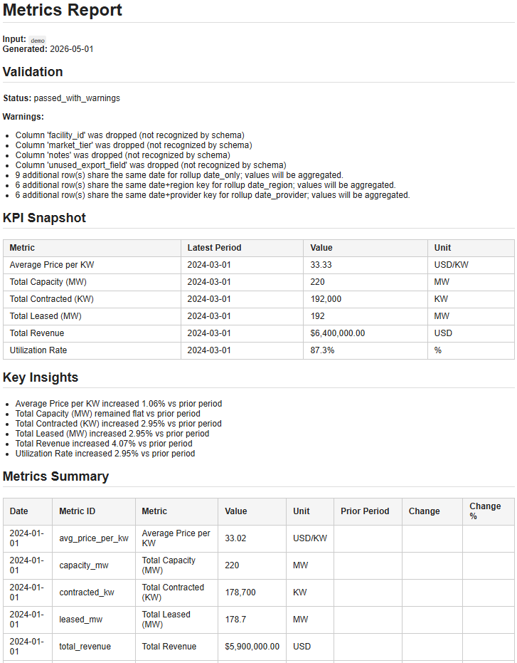
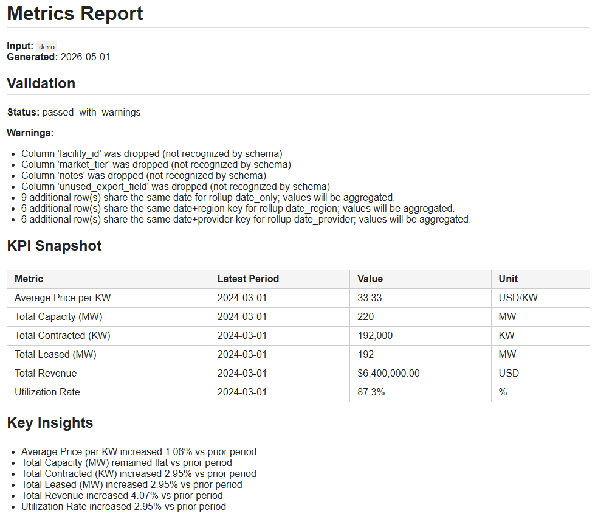

# Demo — End-to-End Pipeline Walkthrough

This folder documents the full Intake → Metrics → Report pipeline run on the sample data center dataset.

---

## Sample Dataset

**File:** `intake_engine/tests/fixtures/messy_data_center_sample_for_intake.csv`

A realistic messy export representing 3 months of data center operational data across 2 regions and 2 providers (12 source rows, 4 per month).

**What makes it messy:**
- Non-standard column headers (`Report Date`, `Total Revenue ($)`, `Geo`, `Vendor`)
- Extra non-metric columns (`facility_id`, `market_tier`, `notes`, `unused_export_field`)
- Dollar-sign formatting in the revenue column
- Inconsistent naming conventions across fields

**What the pipeline produces from it:**
- 6 validated KPIs calculated at 4 rollup levels
- 3 months of prior-period trend analysis
- A client-ready HTML report with KPI Snapshot and Key Insights
- A compact executive summary variant

---

## Commands

Run from the repo root. Each engine requires its own `cd`.

### Prerequisites

```bash
cd intake_engine && pip install -e . && cd ..
cd metrics_engine && pip install -e . && cd ..
cd report_engine && pip install -e . && cd ..
```

### Step 1 — Intake Engine

Clean and validate the raw source file.

```bash
cd intake_engine
intake run tests/fixtures/messy_data_center_sample_for_intake.csv --profile --validate
cd ..
```

**Outputs** (`intake_engine/outputs/`):

| File | Description |
|---|---|
| `messy_data_center_sample_for_intake_clean.csv` | Schema-normalized, cleaned data |
| `messy_data_center_sample_for_intake_report.html` | Self-contained HTML quality report |
| `messy_data_center_sample_for_intake_validation.json` | Validation result (PASS / WARN / FAIL) |
| `messy_data_center_sample_for_intake_profile.json` | Semantic type inference and transformation log |

### Step 2 — Metrics Engine

Calculate KPIs with prior-period time analysis.

```bash
cd metrics_engine
metrics-engine run \
  --input ../intake_engine/outputs/messy_data_center_sample_for_intake_clean.csv \
  --output outputs/demo \
  --with-time
cd ..
```

**Outputs** (`metrics_engine/outputs/demo/`):

| File | Description |
|---|---|
| `long_metrics.csv` | One row per metric per rollup level; includes `prior_period_value`, `period_change`, `period_change_pct` |
| `wide_metrics.csv` | One row per date+segment with metrics as columns |
| `metric_dictionary.csv` | Definitions, units, and descriptions for all 6 KPIs |
| `validation_report.json` | Full validation status, errors, and warnings |
| `metrics_output.xlsx` | All outputs in a single Excel workbook |

**KPIs calculated:**

| Metric | Type | Unit |
|---|---|---|
| Total Revenue | sum | USD |
| Total Capacity (MW) | sum | MW |
| Total Leased (MW) | sum | MW |
| Total Contracted (KW) | sum | KW |
| Utilization Rate | ratio (leased / capacity) | % |
| Average Price per KW | per-unit (revenue / contracted_kw) | USD/KW |

### Step 3 — Report Engine, full report

Generate a complete client report with all sections.

```bash
cd report_engine
report-engine build \
  --input ../metrics_engine/outputs/demo \
  --output outputs/demo_full_report
```

**Outputs** (`report_engine/outputs/demo_full_report/`):

| File | Description |
|---|---|
| `report.html` | Self-contained HTML report — KPI Snapshot, Key Insights, Metrics Summary, Metric Dictionary |
| `report.md` | Same content in Markdown |
| `summary.json` | Machine-readable metadata: validation status, metric count, date range, template name |
| `insights.json` | Deterministic period-over-period insight records (one per metric with valid change data) |



### Step 4 — Report Engine, executive summary

Generate a compact executive summary with KPI Snapshot and Key Insights only.

```bash
report-engine build \
  --input ../metrics_engine/outputs/demo \
  --output outputs/demo_executive_summary \
  --template executive_summary
cd ..
```

Same output files; `report.html` and `report.md` contain only Header, Validation, KPI Snapshot, and Key Insights.



---

## Report Templates

| Template | Sections |
|---|---|
| `full_report` (default) | Header → Validation → KPI Snapshot → Key Insights → Metrics Summary → Metric Dictionary |
| `executive_summary` | Header → Validation → KPI Snapshot → Key Insights |
| `metrics_detail` | Header → Validation → Metrics Summary → Metric Dictionary |

`summary.json` and `insights.json` are always written regardless of which template is selected.

---

## What the Report Shows

### KPI Snapshot

Latest available value for each metric, most recent period only — one row per KPI.

### Key Insights

Deterministic bullets derived from `period_change_pct`. Each insight names the metric, direction (increased / decreased / remained flat), and the formatted percentage change vs. the prior period.

Example output (generated from 3 months of data):
```
- Total Revenue increased 3.9% vs. prior period
- Utilization Rate increased 3.0% vs. prior period
- Total Contracted (KW) increased 3.0% vs. prior period
```

No AI-generated commentary — every insight is grounded directly in the metric data.

### Metrics Summary

Full long-format table sorted by date then metric ID. USD values are formatted as `$X,XXX,XXX.XX`, percent values as `XX.X%`, and large whole numbers with comma separators.

### Metric Dictionary

Client-friendly definitions table with display headers (Metric ID, Metric, Type, Unit, Description).
