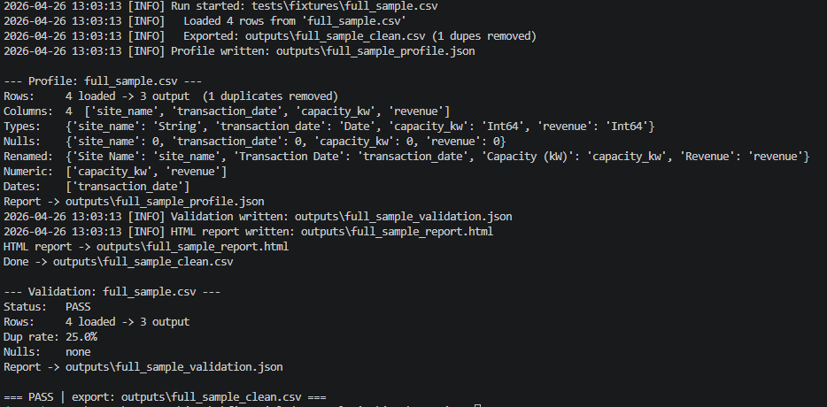
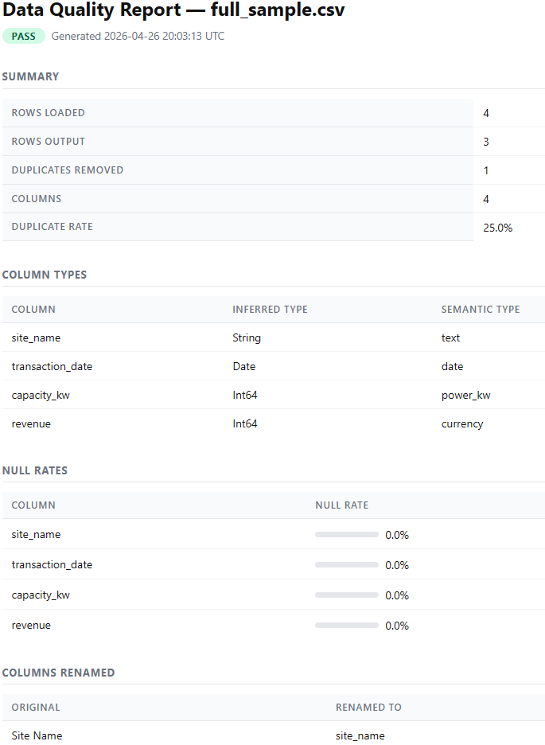

# intake_engine

A modular CLI tool for ingesting messy CSV and XLSX files and converting them into clean, analytics-ready datasets.

Handles delimiter detection, header normalization, numeric and date cleaning, data validation, profiling, HTML reporting, and optional DuckDB export — all from a single command.

---

## Overview

Real-world data arrives inconsistent: mixed date formats, currency symbols in numeric columns, inconsistent headers, duplicates, and files with no schema enforcement. `intake_engine` solves this at the ingestion layer so downstream analytics can trust the data.

```bash
intake run data/messy_report.xlsx --profile --validate
```

Outputs a cleaned CSV (or Parquet), a validation result (PASS / WARN / FAIL), a profiling summary, and a self-contained HTML report — no configuration required to get started.

---
## Example Run



## Key Features

- **Smart loading** — Auto-detects CSV delimiters (comma, semicolon, pipe, tab); supports multi-sheet Excel workbooks
- **Header normalization** — Trims, lowercases, and snake_cases all column names
- **Cell cleaning** — Strips whitespace, converts blank strings to `null`
- **Numeric normalization** — Removes `$`, `,`, `%`, and parenthetical negatives from numeric strings before coercion
- **Date normalization** — Parses and standardizes 12+ date formats to ISO 8601
- **Unit conversion** — Normalizes power columns (MW → kW) for consistency
- **Type coercion** — Promotes all-numeric string columns to `Int64` or `Float64`
- **Deduplication** — Removes exact duplicate rows, preserves row order
- **Validation** — Checks required columns, null rates, duplicate rates, and column-level type rules; returns PASS / WARN / FAIL
- **Profiling** — Infers semantic types (currency, date, power, identifier, text) and tracks all transformations applied
- **HTML reports** — Generates self-contained, styled quality reports per file
- **Parquet export** — Write compressed, schema-preserving Parquet alongside CSV
- **DuckDB sink** — Load cleaned data directly into a DuckDB table with `append` or `replace` modes
- **Batch processing** — Run against a folder of files or all sheets in an Excel workbook; aggregates a run summary
- **Config-driven** — Override thresholds, required columns, column rename rules, and output format via YAML

---
## HTML Quality Report



## Architecture

```
intake_engine/
├── cli/          # Typer CLI — run, validate, profile commands
├── loader/       # File ingestion: CSV, XLSX, TSV; delimiter detection
├── cleaner/      # 7-step cleaning pipeline; column map/selection
├── validator/    # Quality checks: required cols, null/dup rates, type rules
├── profiler/     # Semantic type inference; transformation tracking
├── reporter/     # Self-contained HTML report generation
├── exporter/     # Write CSV or Parquet output
├── db/           # DuckDB integration: append or replace
├── models/       # Pydantic models: PipelineConfig, ValidationReport, ProfileReport
└── utils/        # Custom exceptions, logging
```

Each module is a focused, independently testable unit. The CLI orchestrates them; individual modules can also be imported directly as a library.

---

## Example CLI Usage

**Run with defaults (CSV output):**
```bash
intake run data/sales.csv
```

**Run with profiling and validation (also generates HTML report):**
```bash
intake run data/sales.xlsx --profile --validate
```

**Export to Parquet:**
```bash
intake run data/sales.csv --format parquet
```

**Validate without exporting:**
```bash
intake validate data/sales.csv
```

**Profile only:**
```bash
intake profile data/sales.csv
```

**Process all sheets in an Excel workbook:**
```bash
intake run data/workbook.xlsx --sheet all
```

**Batch process a folder:**
```bash
intake run data/monthly_reports/
```

**Load into DuckDB:**
```bash
intake run data/sales.csv --db analytics.duckdb --table sales --db-mode append
```

**Use a config file:**
```bash
intake run data/sales.csv --config pipeline.yaml
```

**Fail the pipeline on validation errors:**
```bash
intake run data/sales.csv --fail-on-validation
```

**Example `pipeline.yaml`:**
```yaml
required_columns:
  - provider_name
  - site_name
  - available_mw
null_threshold: 0.20
duplicate_threshold: 0.10
output_format: parquet
column_rules:
  available_mw:
    type: float
    nullable: false
  provider_name:
    rename: vendor
```

**Default outputs:**
```
outputs/{filename}_clean.csv        # Cleaned data (always)
outputs/{filename}_profile.json     # Profiling report (with --profile)
outputs/{filename}_validation.json  # Validation report (with --validate)
outputs/{filename}_report.html      # HTML quality report (with --profile or --validate)
logs/run.log                        # Full execution log (always)
```

HTML reports are generated automatically whenever `--profile` or `--validate` is passed to `intake run`, and always by the `intake validate` and `intake profile` subcommands.

---

## Tech Stack

| Library | Role |
|---|---|
| [Polars](https://pola.rs/) | DataFrame engine — fast, typed, memory-efficient |
| [Typer](https://typer.tiangolo.com/) | CLI framework — clean argument parsing and help text |
| [Pydantic v2](https://docs.pydantic.dev/) | Config and model validation |
| [DuckDB](https://duckdb.org/) | Embedded analytical database sink |
| [openpyxl](https://openpyxl.readthedocs.io/) / [fastexcel](https://github.com/ToucanToco/fastexcel) | Excel reading |
| [PyYAML](https://pyyaml.org/) | Pipeline config parsing |
| [pytest](https://pytest.org/) | Test suite |
| Python 3.11+ | Runtime |

---

## Project Motivation

Analytics and consulting work routinely starts with ingesting data from multiple sources — client exports, third-party reports, operational system dumps. These files are almost never clean: headers vary, dates come in every format, numbers include formatting characters, and sheets get merged inconsistently.

`intake_engine` was built to handle this problem once, properly, instead of writing ad-hoc cleaning scripts for every new dataset. It provides a reliable, observable ingestion layer — with validation, profiling, and logging built in — so that downstream analysis can start from a trusted foundation.

---

## Install

```bash
git clone https://github.com/Mat-Horobjowsky/financial-data-analytics.git
cd financial-data-analytics/intake_engine
py -3.12 -m venv .venv
.venv\Scripts\activate       # Windows
# source .venv/bin/activate  # macOS / Linux
pip install -e .
```

Requires Python 3.11+. Python 3.12 is the recommended and validated environment for this repo.

---

## Run Tests

```bash
pytest
```

The test suite covers all modules: loader, cleaner, validator, profiler, reporter, exporter, DuckDB writer, batch processing, and end-to-end CLI pipelines.

---

## Future Roadmap

- [ ] JSON and NDJSON input support
- [ ] Schema inference and enforcement across repeated file ingestion
- [ ] Web dashboard for viewing HTML reports
- [ ] Pluggable custom validation rules
- [ ] SQLite and PostgreSQL export sinks
- [ ] GitHub Actions CI pipeline
- [ ] PyPI package publication
