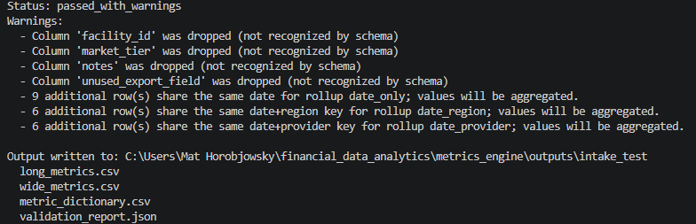
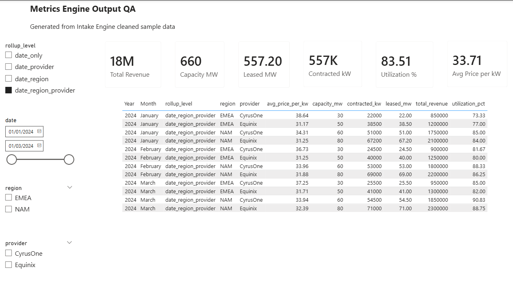

# Metrics Engine

A config-driven pipeline that turns cleaned financial data into validated, rolled-up metric outputs ready for Power BI or Excel.

## Where it fits

```
Intake Engine  →  Metrics Engine  →  Power BI / Excel
(raw → clean)      (clean → metrics)
```

Metrics Engine expects reasonably clean tabular input. It can normalize known column aliases, but heavy raw-file cleanup belongs in Intake Engine.

---

## v1 Pipeline

```
CSV / Excel
    └─ loader          parse file into a DataFrame
    └─ schema          normalize column names and types; drop unknowns
    └─ metric_registry load metrics.yaml (metric definitions + rollup levels)
    └─ validator       check for errors and data quality issues
    └─ calculator      compute metrics at each rollup level (sum-before-divide)
    └─ output_builder  produce long + wide metric tables and a metric dictionary
    └─ exporter        write all four output files to disk
```

---

## Install / Setup

Requires Python 3.11+.

```bash
pip install -r requirements.txt
```

Config files live in `config/`:
- `config/schema.yaml` — recognized column names and aliases
- `config/metrics.yaml` — metric definitions and rollup levels

---

## CLI Commands

### Validate only (no files written)

```
py -m metrics_engine.cli validate --input <file>
```

Checks for errors and data quality issues. Prints a status report. Exits non-zero if validation failed.

```
python -m metrics_engine.cli validate --input <file>
```

### Full run (validate + calculate + export)

```
py -m metrics_engine.cli run --input <file> --output <dir>
```

```
python -m metrics_engine.cli run --input <file> --output <dir>
```

Optional flags:
- `--config config/metrics.yaml` (default)
- `--schema config/schema.yaml` (default)
- `--dry-run` — validate only, same as `validate` subcommand

---

## End-to-End Example

Using the cleaned Intake Engine output:

```
py -m metrics_engine.cli validate --input data/messy_data_center_sample_for_intake_clean.csv
```

```
py -m metrics_engine.cli run --input data/messy_data_center_sample_for_intake_clean.csv --output outputs/intake_test/
```

---

## Example Run

Running Metrics Engine on cleaned Intake Engine output produces a validation summary and four output files:



The generated `wide_metrics.csv` can be loaded directly into Power BI for KPI validation and quick dashboarding:



---

## Output Files

All four files are written to the output directory on a successful run.

| File | Description |
|---|---|
| `long_metrics.csv` | One row per metric per rollup level. Best for filtering and analysis. |
| `wide_metrics.csv` | One row per date+segment combination with metrics as columns. Best for quick visuals. |
| `metric_dictionary.csv` | Definitions, units, and descriptions for every metric. |
| `validation_report.json` | Full validation status, errors, and warnings. |

---

## Power BI Notes

- Use **`wide_metrics.csv`** for quick visuals.
- Always **filter by `rollup_level`** to avoid double-counting — totals and segment-level rows both exist in the same file.
- Use `date_region_provider` for detailed views, `date_only` for executive totals.

---

## Understanding Validation Output

### Status values

| Status | Meaning |
|---|---|
| `passed` | No issues found. |
| `passed_with_warnings` | Data loaded and metrics will be calculated. Warnings are informational. |
| `failed` | A hard error was found. No metric files are written. |

`passed_with_warnings` is a **successful** outcome. Warnings do not block calculation.

### Common warnings

**Dropped columns** — a column in your file was not recognized by `schema.yaml` and was excluded. This is expected for any non-metric, non-segment columns.

**Aggregation notices** — multiple rows share the same date (or date+segment) key for a given rollup level. This is expected when your input has one row per provider and the pipeline rolls up to date-only totals. Values will be summed during calculation.

Example:
```
2 additional row(s) share the same date for rollup date_only; values will be aggregated.
```
## v1.1 Time Analysis

Metrics Engine can optionally enrich `long_metrics.csv` with prior-period comparison fields:

```
py -m metrics_engine.cli run --input data/sample_data_centers.csv --output outputs/time_test/ --with-time

Adds:

prior_period_value
period_change
period_change_pct

Time analysis is applied within each comparable group: rollup_level + segment columns + metric_id, so regions, providers, rollup levels, and metrics are not compared against each other.

---

## v1 Scope / Deferred

The following are **out of scope for v1** and deferred to future versions:

- Time intelligence (period-over-period, rolling averages, YTD)
- SQL export
- Power BI API push
- GUI or web interface
- AI Q&A / natural language queries
- Arbitrary formula parsing
- `weighted_avg` metric type

---

## Architecture Principles

- **Config-driven metrics** — all metric definitions live in `config/metrics.yaml`; no hardcoded business logic in Python
- **Schema-driven column normalization** — column aliases and types are declared in `config/schema.yaml`
- **Validation before calculation** — the pipeline halts on hard errors before touching any math
- **Sum-before-divide metric math** — ratios and per-unit metrics aggregate numerators and denominators separately before dividing, preventing weighted-average distortion
- **Long + wide outputs** — long format for flexible analysis, wide format for direct Power BI / Excel use
- **No `eval`, no formula parsing** — metric math is fully declarative; no dynamic code execution
