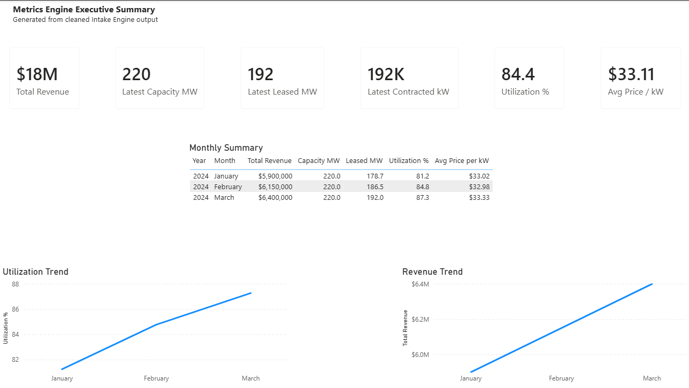
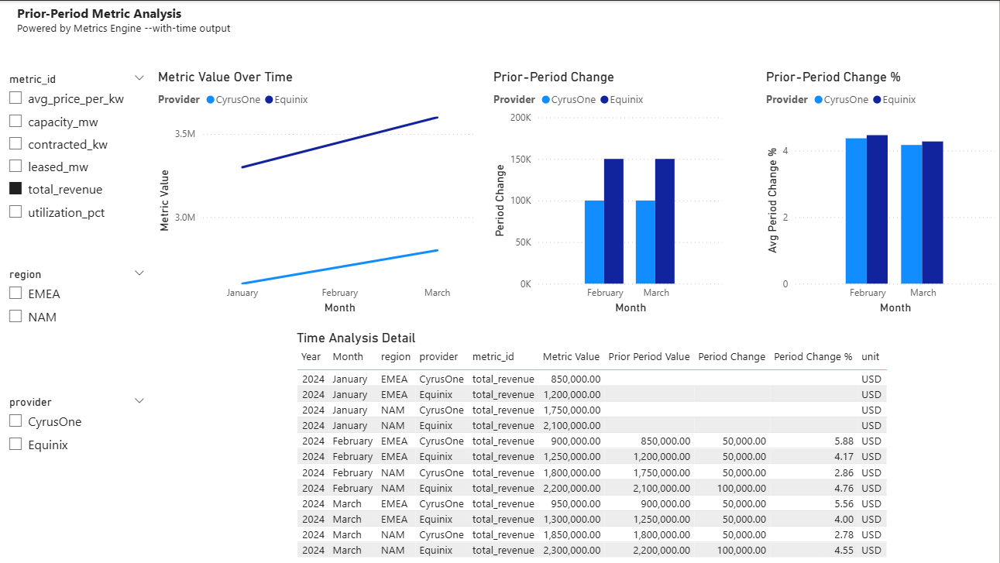
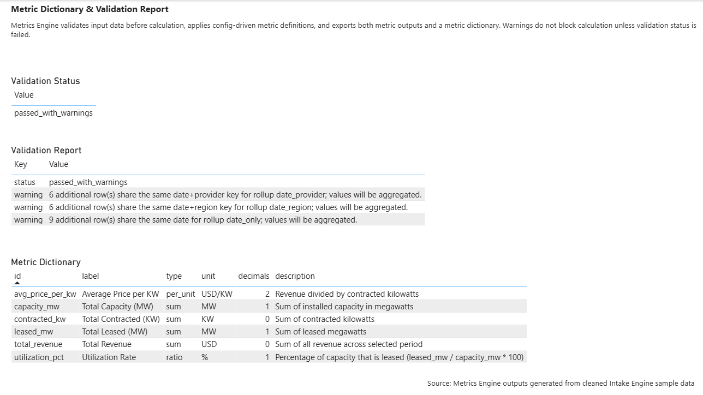

# Metrics Engine

A config-driven pipeline that turns cleaned financial data into validated, rolled-up metric outputs ready for Power BI or Excel.

## Where it fits

```
Intake Engine  →  Metrics Engine  →  Power BI / Excel
(raw → clean)      (clean → metrics)
```

Metrics Engine expects reasonably clean tabular input. It can normalize known column aliases, but heavy raw-file cleanup belongs in Intake Engine.

---

## v1 Pipeline

```
CSV / Excel
    └─ loader          parse file into a DataFrame
    └─ schema          normalize column names and types; drop unknowns
    └─ metric_registry load metrics.yaml (metric definitions + rollup levels)
    └─ validator       check for errors and data quality issues
    └─ calculator      compute metrics at each rollup level (sum-before-divide)
    └─ output_builder  produce long + wide metric tables and a metric dictionary
    └─ exporter        write all four output files to disk
```

---

## Install / Setup

Requires Python 3.11+.

```bash
pip install -e .
```

For development (includes test runner):

```bash
pip install -e ".[dev]"
```

Config files live in `config/`:
- `config/schema.yaml` — recognized column names and aliases
- `config/metrics.yaml` — metric definitions and rollup levels

---

## CLI Commands

### Validate only (no files written)

```bash
metrics-engine validate --input <file>
```

Checks for errors and data quality issues. Prints a status report. Exits non-zero if validation failed.

### Full run (validate + calculate + export)

```bash
metrics-engine run --input <file> --output <dir>
```

Optional flags:
- `--config config/metrics.yaml` (default)
- `--schema config/schema.yaml` (default)
- `--dry-run` — validate only, same as `validate` subcommand
- `--with-time` — enrich output with prior-period comparison columns

---

## End-to-End Example

Using the cleaned Intake Engine output:

```bash
metrics-engine validate --input data/messy_data_center_sample_for_intake_clean.csv
```

```bash
metrics-engine run --input data/messy_data_center_sample_for_intake_clean.csv --output outputs/intake_test/
```

---

## Example Run

Running Metrics Engine on cleaned Intake Engine output produces a validation summary and five output files:

```bash
metrics-engine run --input data/messy_data_center_sample_for_intake_clean.csv --output outputs/intake_test/ --with-time
```


The generated `wide_metrics.csv` can be loaded directly into Power BI for KPI validation and quick dashboarding:


---

## Metrics Engine CLI output

The generated outputs can be loaded directly into Power BI for KPI validation, executive reporting, and prior-period analysis.

Executive Summary

wide_metrics.csv powers executive-level KPI cards, monthly summaries, and trend visuals.



Prior-Period Time Analysis

When run with --with-time, long_metrics.csv includes prior-period comparison fields for time-series analysis.



Metric Dictionary & Validation

Metrics Engine also exports a metric dictionary and validation report so outputs are auditable and easier to trust.




## Output Files

All five files are written to the output directory on a successful run.

| File | Description |
|---|---|
| `long_metrics.csv` | One row per metric per rollup level. Values rounded per metric config. Best for filtering and analysis. |
| `wide_metrics.csv` | One row per date+segment combination with metrics as columns. Best for quick visuals. |
| `metric_dictionary.csv` | Definitions, units, and descriptions for every metric. |
| `validation_report.json` | Full validation status, errors, and warnings. |
| `metrics_output.xlsx` | All four outputs in a single Excel workbook (long\_metrics, wide\_metrics, metric\_dictionary, validation\_report sheets). Header row frozen; columns auto-sized. |

---

## Power BI Notes

- Use **`wide_metrics.csv`** for quick visuals.
- Always **filter by `rollup_level`** to avoid double-counting — totals and segment-level rows both exist in the same file.
- Use `date_region_provider` for detailed views, `date_only` for executive totals.

---

## Understanding Validation Output

### Status values

| Status | Meaning |
|---|---|
| `passed` | No issues found. |
| `passed_with_warnings` | Data loaded and metrics will be calculated. Warnings are informational. |
| `failed` | A hard error was found. No metric files are written. |

`passed_with_warnings` is a **successful** outcome. Warnings do not block calculation.

### Common warnings

**Dropped columns** — a column in your file was not recognized by `schema.yaml` and was excluded. This is expected for any non-metric, non-segment columns.

**Aggregation notices** — multiple rows share the same date (or date+segment) key for a given rollup level. This is expected when your input has one row per provider and the pipeline rolls up to date-only totals. Values will be summed during calculation.

Example:
```
2 additional row(s) share the same date for rollup date_only; values will be aggregated.
```
## v1.1 Time Analysis

Metrics Engine can optionally enrich `long_metrics.csv` with prior-period comparison fields:

```bash
metrics-engine run --input data/sample_data_centers.csv --output outputs/time_test/ --with-time
```

Adds:

- `prior_period_value` — previous period's value (rounded per metric's `decimals`)
- `period_change` — value minus prior (rounded per metric's `decimals`)
- `period_change_pct` — percentage change (rounded to 2 decimals; NaN when prior is zero or missing)

Time analysis is applied within each comparable group: rollup_level + segment columns + metric_id, so regions, providers, rollup levels, and metrics are not compared against each other.

## v1.1.1 Output Polish

- **Rounded values** — `value` in `long_metrics.csv` is rounded to each metric's configured `decimals`. Time columns follow the same rounding.
- **Excel workbook** — every run writes `metrics_output.xlsx` alongside the CSV files.

---

## Readiness Metrics Pack v0.1

The engine ships with a second config pack for transaction-readiness and RFP-readiness analytics alongside the default market/operating config.

### How it works

The readiness pack uses the same pipeline and output format as market/operating metrics. Only the configs differ. Three new generic metric types are supported:

| Type | Behavior |
|---|---|
| `count` | Row count per group — no source column required |
| `conditional_count` | Count rows where `source_col` is in `condition_values` |
| `completion_pct` | Count rows in `complete_values` / total rows × `scale` |

These types are fully generic. The domain-specific meaning lives in the YAML config, not in engine code.

### Config files

| File | Purpose |
|---|---|
| `config/readiness_metrics.yaml` | Readiness metric definitions |
| `config/readiness_schema.yaml` | Readiness column schema (includes `condition_columns`) |
| `data/sample_readiness.csv` | Sample input: 20 requirements across 6 categories and 2 projects |

### CLI command

```
py -m metrics_engine.cli run ^
  --input metrics_engine/data/sample_readiness.csv ^
  --config metrics_engine/config/readiness_metrics.yaml ^
  --schema metrics_engine/config/readiness_schema.yaml ^
  --output outputs/readiness
```

### Readiness metrics produced

| Metric | Type | Description |
|---|---|---|
| `total_requirement_count` | `count` | Total requirements in scope |
| `open_gap_count` | `conditional_count` | Requirements not yet complete |
| `critical_item_count` | `conditional_count` | Requirements marked critical |
| `readiness_completion_pct` | `completion_pct` | % of requirements marked complete or closed |

Rollups are computed at date-only, by category, by market, and by category+market — all configured in `readiness_metrics.yaml`.

---

## v1 Scope / Deferred

The following are **out of scope for v1** and deferred to future versions:

- Time intelligence (Advanced time intelligence such as rolling averages and YTD)
- SQL export
- Power BI API push
- GUI or web interface
- AI Q&A / natural language queries
- Arbitrary formula parsing
- `weighted_avg` metric type

---

## Architecture Principles

- **Config-driven metrics** — all metric definitions live in `config/metrics.yaml`; no hardcoded business logic in Python
- **Schema-driven column normalization** — column aliases and types are declared in `config/schema.yaml`
- **Validation before calculation** — the pipeline halts on hard errors before touching any math
- **Sum-before-divide metric math** — ratios and per-unit metrics aggregate numerators and denominators separately before dividing, preventing weighted-average distortion
- **Long + wide outputs** — long format for flexible analysis, wide format for direct Power BI / Excel use
- **No `eval`, no formula parsing** — metric math is fully declarative; no dynamic code execution
